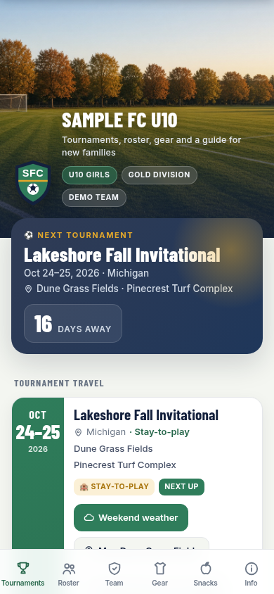

# Sideline

Sideline is a phone site for one youth sports team. Families use it for tournaments, the roster, gear, snacks, and a short guide. You change one file, `src/team.json`, and the site updates.

The team in this repo is Sample FC. Every player, family, field, hotel, and club name in the demo is invented.



## Copy the repo, edit the team file, and deploy

You need [Node.js](https://nodejs.org/) 18 or newer. There is nothing to install.

1. Copy this repo. On GitHub, click the green [**Use this template**](https://github.com/minyona/team-site-starter/generate) button. GitHub makes a repo in your account. Edits in your repo do not change this repo. The Deploy to Netlify button below is the one-click alternative. That button copies the repo into your GitHub account and publishes it. If you do not use GitHub, choose **Code**, then **Download ZIP**, and unzip it.
2. Edit `src/team.json`. That file is the whole site.
3. Deploy. Netlify runs `node build.mjs` and publishes the `dist` folder. It does not install packages.

[](https://app.netlify.com/start/deploy?repository=https://github.com/minyona/team-site-starter) [**Use this template**](https://github.com/minyona/team-site-starter/generate)

From the project folder, run these two commands after every change to `src/team.json`.

```bash
node build.mjs
node check.mjs
```

`node build.mjs` checks `src/team.json` and writes the website into `dist`. `node check.mjs` reads that website. It exits 0 when the site passes, and exits 1 when it does not.

To look at the site on your computer, run `python3 -m http.server -d dist 8000` and open `http://localhost:8000`. Add `?today=2026-10-08` to pin the date used for countdowns. The picture above was taken that way, at 390 pixels wide, from the built site.

`node check.mjs` on this public starter refuses any phone that is not `555-01` plus two digits, and any email that does not end in `@example.com`. That rule keeps real contact details out of the demo. `node build.mjs` still writes the site if you later put a real coach phone in your own copy. Read the other FAIL lines. Those are the ones that mean the roster is unsafe.

## Set the team name and colors

`team` is the name families see. `theme` is the four colors, the crest, and the photo at the top of the phone.

```json
"team": {
  "name": "Sample FC U10",
  "shortName": "Sample FC",
  "club": "Sample Football Club",
  "ageGroup": "U10",
  "season": "Fall 2026",
  "tagline": "Tournaments, roster, gear and a guide for new families",
  "pills": ["U10 Girls", "Gold Division", "Demo Team"]
},
"theme": {
  "primary": "#2f7d5b",
  "accent": "#e3a82b",
  "dark": "#14213d",
  "paper": "#f4f6f1",
  "logo": "assets/logo.svg",
  "headerPhoto": "assets/header-field.jpg",
  "headerPhotoAlt": "An empty grass soccer field at sunset, lined with autumn trees"
}
```

`name` is the large title. `shortName` is the small name that stays on screen while a family scrolls. `pills` are the short chips under the title. You can have up to four. `details` is a list of label and value rows on the Team tab, such as club, league, and home field.

Colors are hex codes. `primary` is the brand color. `accent` is the highlight. `dark` is the header and the next-tournament card. `paper` is the page background. `logo` and `headerPhoto` are paths next to the page. Replace the files in `src/assets` if you have your own crest and a photo of an empty field. Do not use a photo that shows children's faces.

## Turn tabs on or off

`tabs` sets which buttons appear, and in which order. A tab with `"enabled": false` is hidden. You can also leave a tab out of the list.

```json
"tabs": [
  { "id": "tournaments", "enabled": true },
  { "id": "roster", "enabled": true },
  { "id": "team", "enabled": true },
  { "id": "gear", "enabled": true },
  { "id": "snacks", "enabled": true },
  { "id": "info", "enabled": true }
]
```

The id has to be one of `tournaments`, `roster`, `team`, `gear`, `snacks`, or `info`. `label` is optional. Keep a custom label to 11 characters or fewer, so it fits on a phone.

## Choose what families can see

```json
"privacy": {
  "allowFullNames": false,
  "rosterDisplay": "names",
  "showParentContacts": false
}
```

`allowFullNames` set to `false` shows a player as a first name and a last initial. Avery Oakfield in the file appears as Avery O. on the site. Set it to `true` only when you want full last names on the roster.

`rosterDisplay` set to `"names"` shows those names. Set it to `"jerseyNumbers"` to show only `Player #7` and hide every player name.

`showParentContacts` set to `false` hides guardian names, phones, and emails. Set it to `true` to list them on the Roster tab. Each guardian card names the child by jersey number, first name, and last initial, even when `allowFullNames` is `true`.

A player row has `firstName`, `lastName`, `jersey`, and optional `guardians`. Do not add a birthday, a phone, or an email on the player. The build rejects those. Guardian phone and email belong under `guardians`, and only if you really want them published.

Staff rows are adults. Coach and manager phones in `staff` are published. Use the real coach phone only on a site you control. Do not put a child's contact there.

`node build.mjs` does not edit `src/team.json`. It writes a stripped copy into the website.

- The raw `team.json` is not copied into `dist`.
- The page holds the stripped copy in `window.SIDELINE_TEAM`.
- With `allowFullNames` false and `rosterDisplay` set to `names`, each last name is cut down to its first letter.
- With `rosterDisplay` set to `jerseyNumbers`, first names and last names are removed.
- With `showParentContacts` false, `guardians` are removed.

The source file still has the full roster. If this GitHub repo is public, anyone can open `src/team.json`. Do not commit real player names, parent phones, or parent emails to a public repo. The stripping protects the website, not the file on GitHub.

## Add a tournament and its fields

Each tournament needs an `id`, a `name`, a `start`, an `end`, and a `status`. Dates look like `2026-10-24`. `status` is `local`, `stayToPlay`, or `tba`.

A field needs a `name`, a `lat`, and a `lon`. The map button and the weekend weather page both use that point.

```json
"fields": [
  {
    "id": "dune-grass",
    "name": "Dune Grass Fields",
    "address": "1 Demo Dunes Way, Lakeshore, MI",
    "lat": 42.9389,
    "lon": -85.7397
  }
]
```

To get `lat` and `lon` from a map, open Google Maps and find the field. On a computer, right-click the spot. On a phone, press and hold. Copy the two numbers, which look like `42.9389, -85.7397`. The first number is `lat`. The second number is `lon`.

Give each field an `id` of lowercase letters, numbers, and hyphens, such as `dune-grass`. On a game, set `field` to that id.

```json
{ "date": "2026-10-24", "time": "08:30", "arrive": "07:45", "field": "dune-grass", "opponent": "Riverbend Otters" }
```

`time` and `arrive` are 24-hour times at the field, such as `08:30` and `14:00`. Leave `arrive` off when you do not want an arrival time. The page does not invent one. `opponent` is the other team. The names in the demo are made up.

If the tournament has one field, you can leave `field` off each game. If it has more than one field, every game needs a `field`, and that value has to match a field `id` on the same tournament.

`website`, `parking`, `checkIn`, `notes`, and `links` are optional text and links families see on the tournament card.

## Add a hotel

Put `hotel` on a tournament when families need a place to stay. `kind` is `host` for the tournament's host hotel, or `teamBlock` for a block your team booked.

```json
"hotel": {
  "name": "Lakeshore Grand Suites",
  "address": "4 Demo Lakefront Blvd, Lakeshore, MI",
  "kind": "host",
  "soldOut": true,
  "soldOutNote": "The host hotel is sold out. Book Harborview Inn below instead.",
  "others": [
    {
      "name": "Harborview Inn",
      "address": "5 Sample Marina Ave, Lakeshore, MI",
      "note": "Stay to play approved",
      "bookingUrl": "https://example.com/harborview-booking"
    }
  ]
}
```

A sold-out hotel stays on the page, dimmed, so families can see which one is gone. `others` is the backup list. Use example links until you have the real booking page.

## Set up snacks

The Snacks tab reads `snacks`. Point `url` at your sign-up sheet.

```json
"snacks": {
  "intro": "Families take turns bringing water and a simple snack after each game.",
  "url": "https://example.com/snack-signup",
  "buttonLabel": "Sign up for a game day",
  "note": "Opens the team's sign-up sheet."
}
```

## Set up uniforms

The Gear tab reads `kits`. Each uniform has a `name`, a `type` of `kit` or `backpack`, and a `shirt` color. `shorts` and `socks` default to the shirt color. Set `stroke` on a light kit so the drawing shows up on white.

```json
"kits": {
  "uniforms": [
    { "name": "Green", "label": "Home", "type": "kit", "shirt": "#2f7d5b" },
    { "name": "White", "label": "Away", "type": "kit", "shirt": "#f2f3f5", "shorts": "#14213d", "socks": "#f2f3f5", "stroke": "#a3a9b3" }
  ],
  "order": {
    "supplier": "Sample Sports Outfitters",
    "url": "https://example.com/team-store",
    "buttonLabel": "Order at the team store",
    "note": "Create an account, then choose Sample FC and U10 Girls Gold."
  }
}
```

`training` is the practice kit. It uses the same kind of colors, plus an `items` list of words such as `Navy training shirt`.

## Add links

`links` are the rows at the bottom of the Info tab. Each one needs a `label` and a `url`. `description` is optional.

```json
"links": [
  { "label": "League schedule", "url": "https://example.com/league-schedule", "description": "Official game times and fields" }
]
```

The same tab shows `guide`, the questions and answers for new families. A string in an answer is a paragraph. `{ "list": ["Cleats", "Water"] }` is a bullet list. `{ "tip": "Follow the league app if the two disagree." }` is a callout.

## Keep the site out of search

`hideFromSearch` defaults to `true` when you leave it out. Leave it on for a youth team.

```json
"hideFromSearch": true
```

With that on, `node build.mjs` marks the site three ways.

- The page gets `<meta name="robots" content="noindex, nofollow">`.
- `dist/robots.txt` says `Disallow: /`.
- `dist/_headers` sends `X-Robots-Tag: noindex, nofollow` for every path.

Set it to `false` only when you want a search engine to list the site. Hiding the website does not hide `src/team.json` on GitHub.

## Set the footer

```json
"footer": {
  "text": "Made for Sample FC U10 families. Add this page to your home screen for one-tap access.",
  "showSidelineCredit": true,
  "sidelineCreditUrl": "https://byminyona.com/sideline"
}
```

`text` is your note. `showSidelineCredit` defaults to `true`. The site then shows the words Made with Sideline. `sidelineCreditUrl` is where those words link. Leave the credit on so the next coach can find this starter. Set `showSidelineCredit` to `false` to hide that line.

## Archive a past season

The live site always reads the current `src/team.json`. Keep an old season as a separate copy, not as another file in the public repo.

1. Copy the whole project folder to a private place. Name the copy with the team and the season, such as `sample-fc-fall-2026`.
2. Leave that copy alone. It is the record of that season, including whatever you put in `src/team.json`.
3. In the live project, edit `src/team.json` for the new season. Change `team.season`, replace `tournaments`, and update `roster`.
4. Run `node build.mjs`, then `node check.mjs`, then deploy again.

Do not commit the old folder to the public repo. Full names in an old `src/team.json` are still public if GitHub has them.

## Open the weekend weather page

Each tournament card has a Weekend weather button. By default the page asks the National Weather Service for the live forecast at each field's `lat` and `lon`. It shows the hours from 7 in the morning through 5 in the afternoon, and it marks kickoff when a game has a `time`.

The National Weather Service publishes about seven days ahead. If the tournament starts further out than that, the page says the forecast is not open yet. Pin the date with `?today=2026-10-23` when you want to preview a weekend that is otherwise too far away.

A `?mock=` query flag forces the sample fixtures shipped with this repo. `?mock=1` is the plain sample. `?mock=alert` uses that sample and adds a wind advisory. `?mock=down` shows the outage message, so you can see what families see when the forecast does not load.

This address previews the sample Lakeshore weekend.

```text
/weather/?t=lakeshore-invitational-2026&today=2026-10-23&mock=1
```

On your computer, that is `http://localhost:8000/weather/?t=lakeshore-invitational-2026&today=2026-10-23&mock=1`.

`?t=` is the tournament `id`. Without it, the page picks the next tournament that still has a field with coordinates. Leave `?mock=` off when you want the live forecast.

## Block a word with the denylist

Create a file named `.sideline-denylist` in the project folder, next to `build.mjs`. Git ignores that file, so your list stays on your computer.

Put one word on each line. `node check.mjs` hashes the word and fails if that word appears anywhere in the site text. A line may instead be 64 hex characters, the hash itself, when you do not want the word written in the file. A whole phrase on one line does not match, because the checker looks at one word at a time.

The checker already rejects one private name from an earlier project, even when your file is missing. Do not add real club names, player names, or family names to the public demo.
